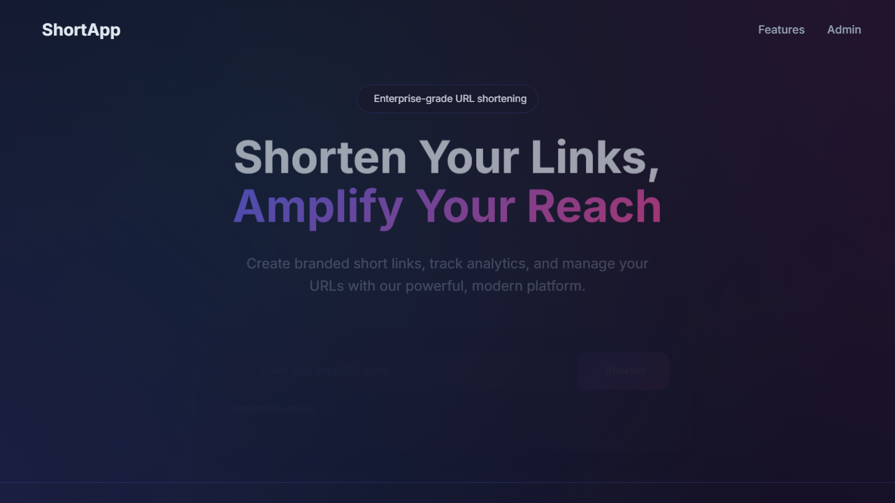
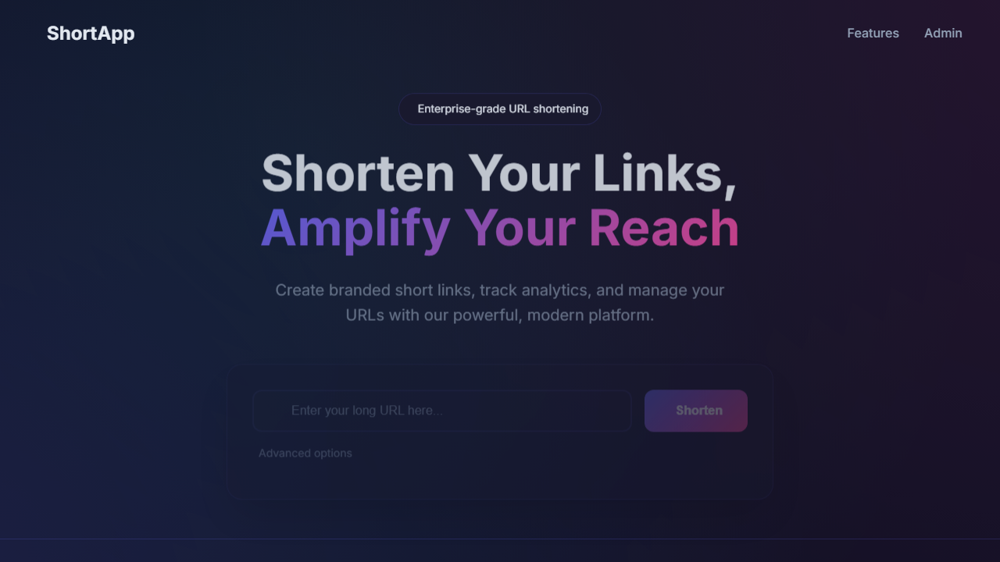
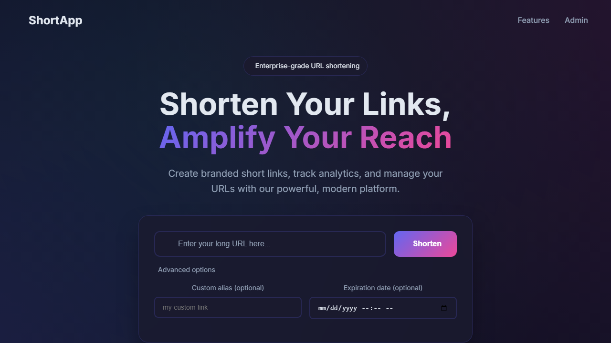
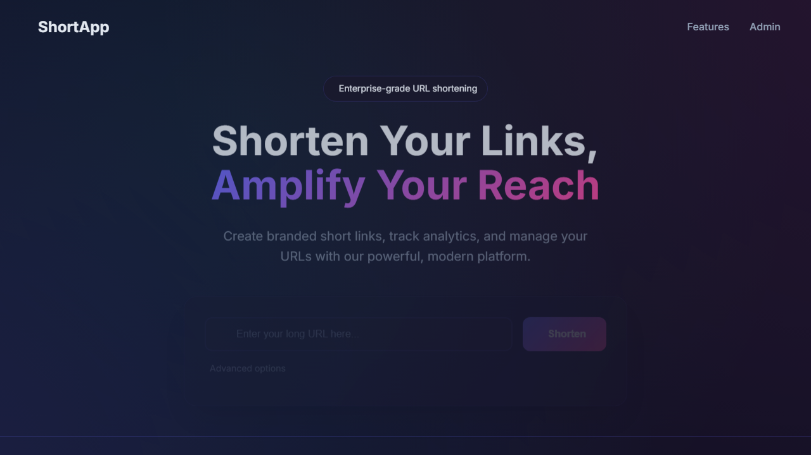
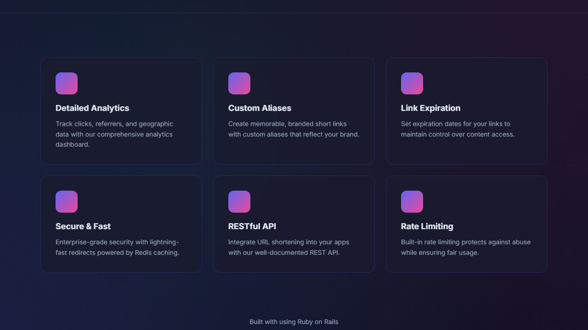
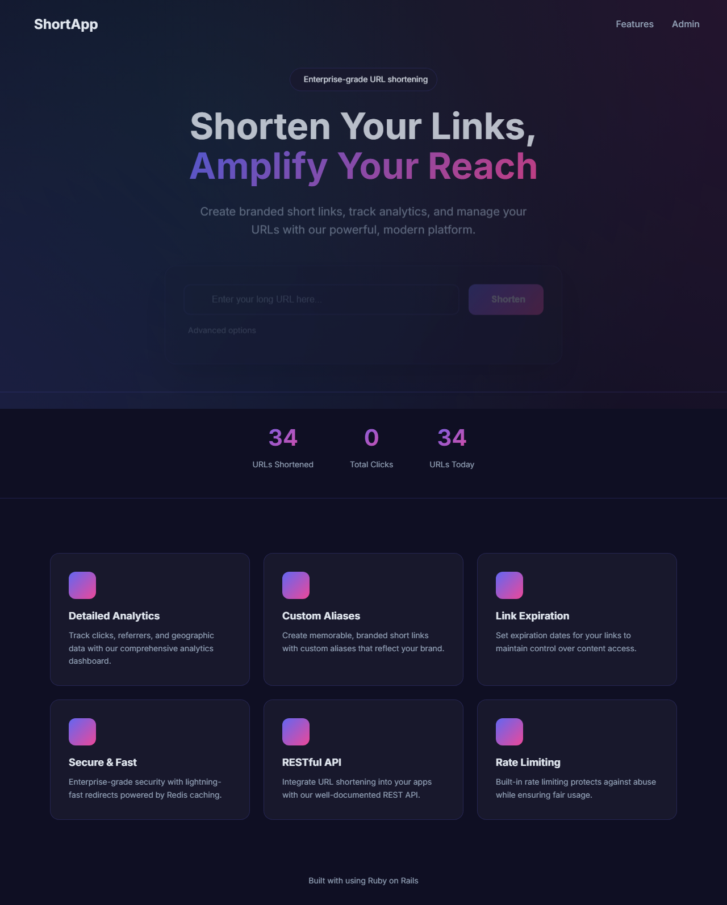
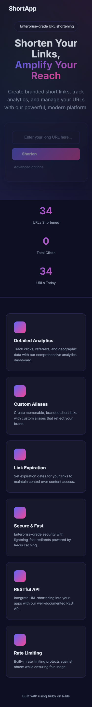

# Short-App URL Shortener

[](https://github.com/femi-lawal/short-app/actions)
[](https://www.ruby-lang.org/)
[](https://rubyonrails.org/)

A production-ready URL shortener built with Ruby on Rails, demonstrating modern software engineering best practices across backend development, DevOps, and SRE disciplines.

## Features

- **URL Shortening**: Create short, memorable URLs using Base62 encoding
- **Click Analytics**: Track access counts and last accessed timestamps
- **Async Title Fetching**: Background job extracts page titles using circuit breaker pattern
- **RESTful API**: Versioned JSON API with pagination and proper error handling
- **Rate Limiting**: Rack::Attack protection against abuse
- **Caching**: Redis-backed caching for high-traffic URLs
- **Observability**: Prometheus metrics, structured logging, health endpoints

## Screenshots

### Homepage - Modern Dark Theme
The application features a premium dark-themed UI with glassmorphism effects, animated gradients, and responsive design.



### URL Shortener Form
Clean, intuitive interface for creating short URLs with advanced options for custom aliases and expiration dates.



### Advanced Options
Expand to set custom aliases and link expiration dates.



### Statistics Dashboard
Real-time statistics showing total URLs shortened, click counts, and today's activity.



### Features Grid
Six feature cards highlighting the application's capabilities.



### Full Page & Mobile View

| Full Page | Mobile |
|-----------|--------|
|  |  |

## Architecture

```
┌─────────────────────────────────────────────────────────────────┐
│                         NGINX Reverse Proxy                     │
│              (SSL termination, rate limiting, caching)          │
└─────────────────────────────────────────────────────────────────┘
                                  │
                                  ▼
┌─────────────────────────────────────────────────────────────────┐
│                         Rails Application                        │
│  ┌──────────────┐  ┌────────────────┐  ┌───────────────────┐   │
│  │ API V1       │  │ Health         │  │ Redirects         │   │
│  │ Controllers  │  │ Controller     │  │ Controller        │   │
│  └──────────────┘  └────────────────┘  └───────────────────┘   │
│                                                                  │
│  ┌──────────────────────────────────────────────────────────┐   │
│  │                      Service Objects                      │   │
│  │  UrlShortenerService  │  TitleFetcherService (Circuit)   │   │
│  └──────────────────────────────────────────────────────────┘   │
└─────────────────────────────────────────────────────────────────┘
          │                              │
          ▼                              ▼
┌──────────────────┐          ┌──────────────────┐
│    MariaDB       │          │      Redis       │
│   (Persistent)   │          │  (Cache + Queue) │
└──────────────────┘          └──────────────────┘
                                      │
                                      ▼
                          ┌──────────────────┐
                          │     Sidekiq      │
                          │    (Workers)     │
                          └──────────────────┘
```

## Quick Start

### Prerequisites

- Docker & Docker Compose
- Make (optional, for convenience commands)

### Development Setup

```bash
# Clone the repository
git clone https://github.com/femi-lawal/short-app.git
cd short-app

# Start the development environment
make dev
# Or: docker compose up -d

# Run database migrations
make db-migrate
# Or: docker compose exec app bin/rails db:migrate

# Verify the app is running
curl http://localhost:3000/health
```

### Create a Short URL

```bash
# Create a short URL
curl -X POST -H "Content-Type: application/json" \
  -d '{"short_url": {"full_url": "https://github.com"}}' \
  http://localhost:3000/api/v1/short_urls

# Response:
# {
#   "success": true,
#   "data": {
#     "id": 1,
#     "short_code": "1",
#     "short_url": "http://localhost:3000/1",
#     "full_url": "https://github.com",
#     "title": null,
#     "click_count": 0
#   }
# }
```

### Test the Redirect

```bash
curl -I http://localhost:3000/1
# HTTP/1.1 301 Moved Permanently
# Location: https://github.com
```

## API Reference

### Endpoints

| Method | Endpoint | Description |
|--------|----------|-------------|
| `GET` | `/api/v1/short_urls` | List top URLs (paginated) |
| `POST` | `/api/v1/short_urls` | Create a short URL |
| `GET` | `/api/v1/short_urls/:short_code` | Get URL details |
| `GET` | `/api/v1/short_urls/:short_code/stats` | Get URL statistics |
| `GET` | `/:short_code` | Redirect to original URL |

### Health Endpoints

| Endpoint | Purpose |
|----------|---------|
| `/health` | Liveness probe |
| `/readiness` | Readiness probe (checks DB + Redis) |
| `/metrics` | Prometheus metrics |

### Rate Limits

| Endpoint | Limit |
|----------|-------|
| General API | 100 req/min per IP |
| URL Creation | 10 req/min per IP |
| URL Creation | 50 req/hour per IP |

## Development

### Common Commands

```bash
# Start development environment
make dev

# Run tests
make test

# Run linter
make lint

# Run security scan
make security

# Open Rails console
make console

# View logs
make logs

# Stop environment
make dev-down
```

### Project Structure

```
short-app/
├── app/
│   ├── controllers/
│   │   ├── api/v1/           # Versioned API controllers
│   │   ├── health_controller.rb
│   │   └── redirects_controller.rb
│   ├── jobs/                  # Sidekiq background jobs
│   ├── models/
│   │   └── short_url.rb       # Main domain model
│   └── services/              # Business logic
│       ├── url_shortener_service.rb
│       └── title_fetcher_service.rb
├── config/
│   ├── initializers/          # Sidekiq, Prometheus, Rack::Attack
│   └── routes.rb
├── db/
│   └── migrate/               # Database migrations
├── k8s/                       # Kubernetes manifests
├── nginx/                     # NGINX configuration
├── spec/                      # RSpec tests
│   ├── factories/
│   ├── models/
│   ├── requests/
│   └── services/
├── .github/workflows/         # CI/CD pipeline
├── docker-compose.yml         # Development environment
├── docker-compose.production.yml  # Production environment
├── Dockerfile                 # Multi-stage build
└── Makefile                   # Developer commands
```

## Deployment

### Docker Production

```bash
# Build production image
make build-prod

# Deploy with docker-compose
docker compose -f docker-compose.production.yml up -d
```

### Kubernetes

```bash
# Apply manifests
kubectl apply -f k8s/

# Verify deployment
kubectl get pods -l app=short-app
kubectl get hpa short-app
```

### Environment Variables

| Variable | Description | Default |
|----------|-------------|---------|
| `RAILS_ENV` | Environment | `development` |
| `DATABASE_URL` | Database connection | - |
| `REDIS_URL` | Redis connection | `redis://localhost:6379` |
| `SECRET_KEY_BASE` | Rails secret | - |
| `SIDEKIQ_CONCURRENCY` | Worker threads | `10` |
| `SIDEKIQ_USERNAME` | Admin UI username | `admin` |
| `SIDEKIQ_PASSWORD` | Admin UI password | - |

## Monitoring

### Prometheus Metrics

The `/metrics` endpoint exposes:

- `http_requests_total` - Total HTTP requests by method/path/status
- `http_request_duration_seconds` - Request latency histogram
- `short_urls_created_total` - URLs created counter
- `url_redirects_total` - Redirects performed
- `sidekiq_jobs_processed_total` - Background job stats
- `rate_limit_hits_total` - Rate limit events

### Health Checks

```bash
# Liveness (is the app running?)
curl http://localhost:3000/health

# Readiness (can it handle requests?)
curl http://localhost:3000/readiness
```

## Testing

```bash
# Run all tests
bundle exec rspec

# Run with coverage
bundle exec rspec --format documentation

# Run specific tests
bundle exec rspec spec/models/
bundle exec rspec spec/requests/
bundle exec rspec spec/services/
```

## Security

- **Brakeman**: Static analysis for security vulnerabilities
- **Rack::Attack**: Rate limiting and blocklisting
- **HTTPS**: Forced in production via NGINX
- **Non-root containers**: Docker runs as unprivileged user
- **Input validation**: URL validation prevents XSS/injection
- **Secrets management**: No hardcoded credentials

## Contributing

See [CONTRIBUTING.md](./CONTRIBUTING.md) for development guidelines.

## Architecture Decisions

See [docs/adr/](./docs/adr/) for Architecture Decision Records.

## License

MIT License - see [LICENSE](./LICENSE) for details.
